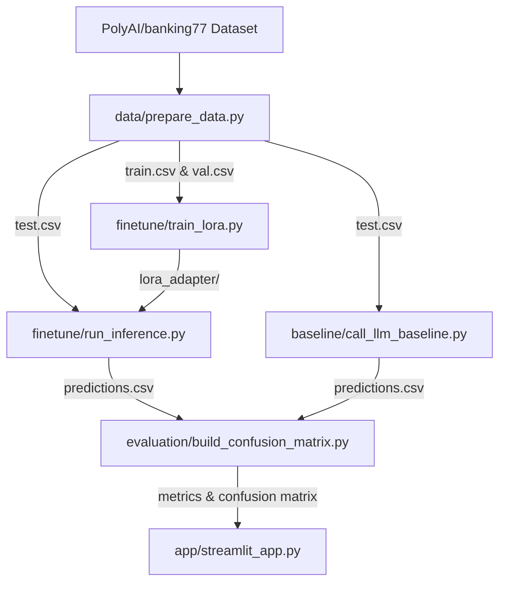

 # IntentClassifier Pro — Tuned vs Prompted

An interactive banking intent classification system that compares a **fine-tuned DistilBERT (via LoRA)** against a **few-shot prompted LLM baseline (gpt-oss-120b)** on the **BANKING77** dataset.

The project demonstrates that a compact model fine-tuned on task-specific data can achieve higher accuracy with significantly lower inference latency compared to prompting a much larger general-purpose LLM.

---

## 📊 Evaluation Results

Here is the comparison between the two classification approaches computed on the full BANKING77 test set:

| Model / Approach | Accuracy | Avg Latency / Sentence | Details |
| :--- | :---: | :---: | :--- |
| **Fine-tuned DistilBERT (LoRA)** | **89.03%** | **23.61 ms** | DistilBERT base fine-tuned with Low-Rank Adaptation (LoRA) |
| **Prompted LLM Baseline** | **87.47%** | **76.30 ms** | `gpt-oss-120b` via Cerebras API with few-shot prompting |

*Note: The fine-tuned LoRA model delivers a **+1.56% accuracy improvement** while running **3.2x faster** on average.*

---

## 🏗️ System Architecture

The workflow consists of data preparation, parallel inference runs, evaluation matrix compilation, and an interactive frontend dashboard:



---

## 📂 Project Structure

```
IntentClassifier-Pro/
├── shared/              # Central config and schema definitions
│   ├── config.py        # Centralized file paths across directories
│   └── schema.py        # Single source of truth for intent labels and columns
├── data/                # Data download and split scripts
│   ├── prepare_data.py  # PolyAI banking77 downloader & stratifier
│   └── *.csv            # Stratified train, val, and test splits (generated)
├── finetune/            # Fine-tuning and local inference pipeline
│   ├── train_lora.py    # PEFT training script on DistilBERT base
│   ├── run_inference.py # LoRA model test set predictor
│   └── lora_adapter/    # Saved adapter weights and configurations
├── baseline/            # LLM baseline pipeline
│   └── call_llm_baseline.py # Batch prompter for gpt-oss-120b
├── evaluation/          # Metrics and error analysis
│   ├── build_confusion_matrix.py # Comparator, accuracy metrics & matrix plotter
│   ├── confusion_matrix.png      # Legible heatmap of top confused intents
│   └── metrics_summary.json      # Offline comparison metrics
└── app/                 # Live web interface
    └── streamlit_app.py # Interactive demo and evaluation dashboard
```

---

## ⚙️ Setup & Installation

Clone the repository and install the dependencies:

```bash
# Clone the repository
git clone https://github.com/shivansh-arch/IntentClassifier-Pro.git
cd IntentClassifier-Pro

# Create and activate virtual environment
python -m venv venv
source venv/bin/activate  # On Windows use: venv\Scripts\activate

# Install requirements
pip install -r requirements.txt
```

### Configure API Keys
Copy `.env.example` to `.env` and fill in your Cerebras API key to run the prompting baseline:
```bash
cp .env.example .env
```

---

## 🚀 Running the Pipeline

Follow these steps to run each part of the project:

1. **Prepare Data** (Stratifies splits & copies labels):
   ```bash
   python data/prepare_data.py
   ```
2. **Train LoRA Model**:
   ```bash
   python finetune/train_lora.py
   ```
3. **Run LoRA Test-Set Inference**:
   ```bash
   python finetune/run_inference.py
   ```
4. **Run LLM Baseline Test-Set Inference**:
   ```bash
   python -m baseline.call_llm_baseline
   ```
5. **Compile Metrics & Confusion Matrix**:
   ```bash
   python evaluation/build_confusion_matrix.py
   ```
6. **Launch Streamlit Web App**:
   ```bash
   streamlit run app/streamlit_app.py
   ```

---

## 💻 Web App Live Demo

The Streamlit web application includes:
* **Interactive Live Demo**: Input custom messages (e.g., *"I lost my wallet, can you block my card?"*) to see classifications from both the fine-tuned and prompting models side-by-side with latency metrics.
* **Results Dashboard**: Displays summary metric comparison cards, the legibly rendered 20x20 confusion matrix, and a data table of the top 10 most common classification mistakes.
